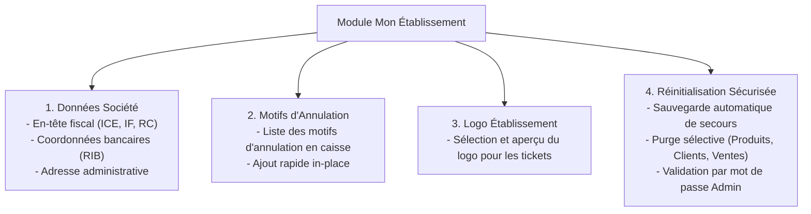
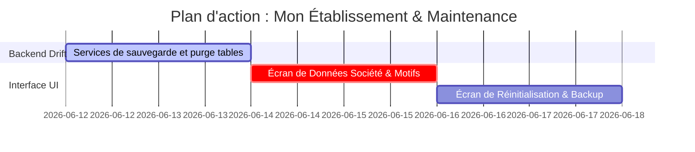

# Plan de Refonte : Mon Établissement & Actions Base de Données

Ce document détaille l'implémentation du module **Mon Établissement (My Company)** et des **Actions de Maintenance de Base de Données** au style *Aronium*, adapté aux impératifs légaux marocains (ICE, IF, banque) et à la sécurisation des données.

---

## 1. Description du Module et des Onglets

Le module s'organisera autour d'une interface à **4 onglets horizontaux** :



---

## 2. Spécifications Techniques par Onglet

### Onglet 1 : Données Société (`Company data`)
Permet de configurer les informations imprimées sur le ticket de caisse et la facture fiscale A4 :
*   **Champs textuels** : Nom commercial, Identifiant Fiscal (IF), Registre du Commerce (RC), ICE (15 chiffres), Patente.
*   **Adresse DGI** : Rue, Numéro, Quartier, Code Postal, Ville, Pays (dropdown par défaut Maroc).
*   **Contacts** : Téléphone, Email.
*   **Banque (RIB)** : Nom de la banque, RIB (24 chiffres) pour les virements et paiements de factures.
*   *Persistance* : Sauvegarde via la table globale `settings` ou une table spécifique `company_info`.

### Onglet 2 : Motifs d'Annulation (`Void reasons`)
Indispensable pour le contrôle interne et pour éviter le coulage. Quand un serveur annule un plat ou une commande en caisse, le POS l'oblige à sélectionner une raison parmi celles configurées ici.
*   **Structure Drift (SQLite)** :
    ```dart
    class VoidReasons extends Table {
      TextColumn get id => text()();
      TextColumn get label => text().withLength(min: 1, max: 100)();
      BoolColumn get isActive => boolean().withDefault(const Constant(true))();
      
      @override
      Set<Column> get primaryKey => {id};
    }
    ```
*   **UI** : Un champ de saisie simple en haut avec un bouton `+ Ajouter le motif`. Une liste en-dessous permettant de supprimer les motifs obsolètes.

### Onglet 3 : Logo Établissement (`My logo`)
Permet de charger une image PNG/JPG locale.
*   Le logo est encodé en Base64 pour être stocké dans les préférences locales ou copié dans le répertoire de l'application.
*   Il sera imprimé en haut des tickets de caisse via l'imprimante réseau ou thermique (ESC/POS).

### Onglet 4 : Réinitialisation & Maintenance (`Reset database`)
Une fonctionnalité indispensable avant de livrer la caisse à un client (pour purger les données de test) ou pour repartir sur de nouvelles bases.
*   **Sécurité en 3 Étapes** :
    1.  **Sauvegarde forcée préalable** : Demande à l'utilisateur de spécifier un dossier de sauvegarde (par défaut `Documents/Ritagestion/Backups`). La base SQLite `.db` actuelle y est copiée avec un horodatage avant toute action de purge.
    2.  **Sélection des entités à réinitialiser** : Cases à cocher pour supprimer sélectivement :
        *   `Produits & Catégories` (Efface le catalogue).
        *   `Clients & Fournisseurs` (Efface l'annuaire).
        *   `Documents & Historique des Ventes` (Efface les commandes, sessions de caisse et rapports).
    3.  **Confirmation par mot de passe** : L'utilisateur doit impérativement saisir le mot de passe de l'administrateur en cours pour débloquer le bouton rouge `Réinitialiser la base de données`.

---

## 3. Implémentation de la Réinitialisation Sécurisée (Dart Code)

```dart
class DatabaseMaintenanceService {
  final MyDatabase _db;

  DatabaseMaintenanceService(this._db);

  Future<void> performReset({
    required String backupDirectory,
    required bool resetProducts,
    required bool resetCustomers,
    required bool resetSales,
  }) async {
    // 1. Exécuter la sauvegarde physique
    final dbFile = File(_db.path);
    final timestamp = DateTime.now().toIso8601String().replaceAll(':', '-');
    final backupPath = '$backupDirectory/backup_$timestamp.db';
    
    await dbFile.copy(backupPath);

    // 2. Purger les tables sélectionnées
    await _db.transaction(() async {
      if (resetSales) {
        await _db.customStatement('DELETE FROM order_items;');
        await _db.customStatement('DELETE FROM orders;');
        await _db.customStatement('DELETE FROM cash_sessions;');
        // Réinitialiser les auto-incréments si nécessaire
      }
      if (resetProducts) {
        await _db.customStatement('DELETE FROM recipe_items;');
        await _db.customStatement('DELETE FROM products;');
        await _db.customStatement('DELETE FROM categories;');
      }
      if (resetCustomers) {
        await _db.customStatement('DELETE FROM contacts WHERE is_customer = 1;');
      }
    });
  }
}
```

---

## 4. Plan de Travail Réparti


