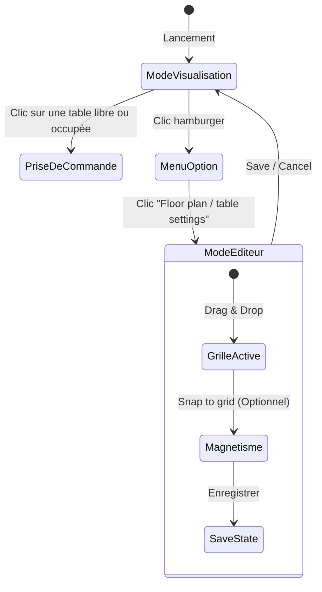
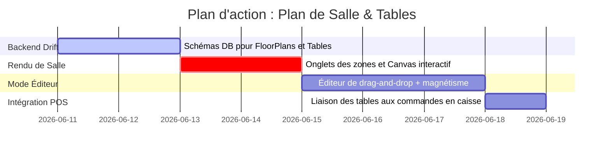

# Plan de Refonte : Plan de Salle Interactif & Éditeur Drag-and-Drop

Ce document détaille l'architecture et la conception technique du module **Plan de Salle (Floor Plan & Tables)** de Ritagestion POS, inspiré du système de disposition d'Aronium. Il comprend le rendu des zones/salles, l'édition interactive avec magnétisme sur grille (Snap-to-grid) et le suivi visuel des tables occupées en temps réel.

---

## 1. Vision Fonctionnelle & Cycle de Vie du Plan de Salle

Le plan de salle possède deux modes d'affichage principaux :



---

## 2. Structure de Données (Drift / SQLite)

Pour stocker les différentes salles (zones) et la position exacte de chaque table sur le canevas :

### A. Table des Salles (Zones / Étages)
```dart
class FloorPlans extends Table {
  TextColumn get id => text()();
  TextColumn get name => text().withLength(min: 1, max: 50)(); // Ex: Salle 1, Terrasse, Étage
  IntColumn get position => integer().withDefault(const Constant(1))(); // Ordre des onglets
  TextColumn get backgroundColor => text().withDefault(const Constant('transparent'))();

  @override
  Set<Column> get primaryKey => {id};
}
```

### B. Table des Tables de Restaurant
```dart
class RestaurantTables extends Table {
  TextColumn get id => text()();
  TextColumn get floorPlanId => text().references(FloorPlans, #id)(); // Liaison salle
  TextColumn get label => text().withLength(min: 1, max: 20)(); // Ex: T1, S6, Table 12
  RealColumn get xPosition => real()(); // Coordonnée X relative (0.0 à 1.0 ou pixel absolu)
  RealColumn get yPosition => real()(); // Coordonnée Y relative
  RealColumn get width => real().withDefault(const Constant(80.0))();  // Largeur de la forme
  RealColumn get height => real().withDefault(const Constant(80.0))(); // Hauteur de la forme
  TextColumn get shape => text().withDefault(const Constant('square'))(); // 'square' (carré) ou 'circle' (ronde)

  @override
  Set<Column> get primaryKey => {id};
}
```

---

## 3. Composants Techniques Flutter (Canevas Interactif)

### A. Rendu Visuel des Tables
*   **Mode Visualisation** :
    *   Les tables sont dessinées dans un `Stack` à l'aide de coordonnées `Positioned`.
    *   **Indicateurs d'état** :
        *   *Vert* : Table libre, aucune commande en cours.
        *   *Orange/Bleu avec montant* : Table occupée, affiche le montant cumulé de la commande en cours (ex: `A1` / `62.00`).
    *   Le clic sur une table ouvre directement l'écran de caisse (POS) pré-lié à cette table.

### B. L'Éditeur Drag-and-Drop (Mode Conception)
*   **Grille d'arrière-plan** : Un widget avec un `CustomPainter` dessine des lignes quadrillées selon le paramètre `Grid Size` configuré dans le tiroir d'options.
*   **Drag & Drop** :
    *   Chaque table est emballée dans un widget `GestureDetector` écoutant l'événement `onPanUpdate`.
    *   **Snap to Grid** (Magnétisme) : Si l'option est activée, la position de la table est arrondie au multiple le plus proche de la taille de la grille :
        ```dart
        double snapValue(double val, double gridSize) {
          return (val / gridSize).round() * gridSize;
        }
        ```
*   **Tiroir d'Options Latéral** :
    *   Contrôle de la taille de la grille (Slider).
    *   Toggles *Afficher la grille* et *Magnétisme*.
    *   Boutons d'action pour ajouter/supprimer des salles et ajouter de nouvelles tables sur le plan.
    *   **Propriétés de la Table Sélectionnée** :
        *   Quand une table est sélectionnée sur le canevas (mise en surbrillance avec bordure bleue), le tiroir affiche les options d'édition :
            *   Nom de la table (Champ texte).
            *   Hauteur (`- Height +` en pixels).
            *   Largeur (`- Width +` en pixels).
            *   Ajustements de position fins (flèches directionnelles).
            *   Choix de la forme : Carrée, Rectangle Arrondi, Circulaire.
            *   Bouton de suppression rouge `Supprimer la table sélectionnée`.

---

## 4. Écran de Transfert & Division de Table (Transfer & Split)

Indispensable en restauration lorsqu'un client change de table ou lorsque deux clients partagent l'addition :
*   **Sélection de la Source** : L'écran s'ouvre depuis une table occupée (ex : `S1`).
*   **Interface à double liste** :
    *   *Liste de gauche* : Articles actuellement commandés sur la table source.
    *   *Boutons centraux de transfert* :
        *   `1 >` : Transfère 1 unité de l'article sélectionné vers la droite.
        *   `>>` : Transfère la totalité de l'article vers la droite.
        *   `Icône Crayon` : Permet de saisir précisément la quantité numérique à transférer.
        *   `< 1` et `<<` : Rapatrient les articles transférés par erreur.
    *   *Liste de droite* : Articles sélectionnés pour le transfert.
*   **Destination du Transfert (Volet droit)** :
    *   Bouton `Sélectionner une commande` : Ouvre la liste des tables ouvertes ou permet de sélectionner une table libre pour y créer la commande.
    *   Bouton `Changer de serveur` : Transfère la commande ou une partie à un autre membre du personnel.
    *   Boutons d'actions rapides : `Transférer tout`, `Tout enlever`, `Transférer par services` (ex: boissons uniquement).
*   **Validation** : Le bouton `OK` effectue la mise à jour transactionnelle dans SQLite (déplacement ou division des lignes de commande d'une table à l'autre).

---

---

## 4. Plan de Travail Réparti


