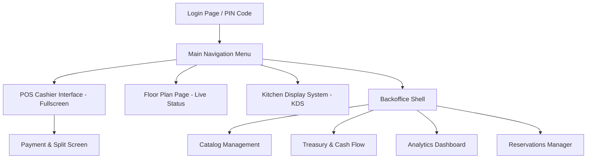
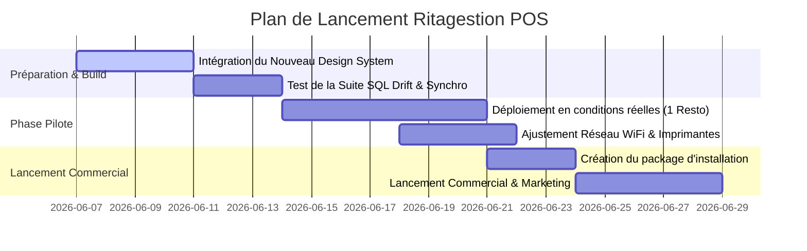

# 🚀 RITAGESTION POS - SPÉCIFICATION DE REFONTE COMMERCIALE 360°
> **Document de Spécification de Référence pour Commercialisation Immédiate (Qualité Mondiale)**

---

## 📌 TABLEAU DE BORD D'AVANCEMENT DE LA REFONTE

| Module / Fonctionnalité | État | Détails / Ce qui a été fait | Reste à faire |
| :--- | :---: | :--- | :--- |
| **Menu Principal (Tuiles)** | 🟢 Fait | Hub central avec une grille 3x3 de 9 tuiles d'accès rapide centrée horizontalement et verticalement sur l'écran. Restriction automatique d'accès en fonction du rôle utilisateur (serveurs vs admin/manager). | — |
| **Login / Authentification PIN** | 🟢 Fait | Clavier tactile à larges cibles (68x68px), design glassmorphism immersif avec cercles lumineux d'arrière-plan, indicateurs de statut de réseau (SQLite local, mDNS, synchronisation Cloud) et animations d'entrée/vibration. | — |
| **Intégration du Stock (Composé)** | 🟢 Fait | Migration Drift v7, support dans le repository, dialogue d'édition responsive à 2 colonnes avec configuration dynamique de fiche technique d'ingrédients, et badge "Recette" sur la carte produit. | — |
| **Caisse / POS (`pos_page.dart`)** | 🟢 Fait | Refonte visuelle complète à 3 colonnes avec bordures fines séparatrices, fond immersif à dégradé radial, cartes produits avec badges recettes/stock, affichage du type de course sur les articles du panier et modification interactive de la course. | — |
| **Gestion de Menu & Backoffice** | 🟢 Fait | Barre latérale dynamique affichant uniquement le sous-menu du module actif (évitant d'encombrer l'écran). Refonte de la page Produits au style *Aronium POS* : barre d'outils d'actions supérieure (Nouveau, Modifier, Activer/Désactiver, Supprimer, Actualiser), moteur de recherche en direct et explorateur de catégories latéral gauche avec pastilles de couleurs. | — |
| **Calculateur de Rendu de Monnaie** | 🟢 Fait | Pavé de rendu de monnaie graphique avec représentations réalistes et élégantes des billets (200, 100, 50, 20 DH) et des pièces (10, 5, 2, 1 DH et centimes) marocaines (MAD). | — |
| ** ICE & Obligations Fiscales** | 🟢 Fait | Saisie de l'ICE client de 15 chiffres avec validation en temps réel sur la caisse, édition et persistance des informations de l'établissement (Nom, Adresse, Téléphone, ICE, IF, RC) dans les Paramètres, conformité DGI avec tickets d'impression contenant l'en-tête fiscal complet et la ventilation de TVA multi-taux. | — |
| **Impression Cuisine & Courses** | 🟢 Fait | Routage IP ESC/POS automatique par station (Cuisine/Bar/etc.) avec configuration réseau et interface de gestion dans les Paramètres. Liaison des catégories aux stations d'impression et gestion des envois partiels par Courses (Entrée/Plat/Dessert). | — |
| **Refonte Statistiques & Reporting** | 🟡 En cours | Rédaction du plan d'implémentation complet au style Aronium (multi-onglets, barre de filtres avancés par utilisateur/client/session, sélecteur de période double calendrier, aperçu de page A4). | Implémenter les requêtes de base de données Drift, le sélecteur double calendrier et l'aperçu A4 tabulaire. |
| **Clients, Suppliers & Promotions** | 🟡 En cours | Rédaction du plan d'implémentation complet pour la refonte Clients (ICE, adresse, remises, tiroir d'édition latéral) et Promotions (moteur de réduction POS par plages horaires, jours de la semaine et catégories). | Créer la table et les liaisons Drift, puis designer le tiroir de contacts à onglets et l'éditeur de promotions en double colonne. |
| **Utilisateurs & Sécurité (RBAC)** | 🟡 En cours | Rédaction du plan d'implémentation complet au style Aronium fondé sur un système hiérarchique simple de niveaux d'accès numériques (0-9) par utilisateur et opération, avec demande d'approbation manager en caisse. | Migrer la table users Drift, coder la grille d'édition de sécurité générale et le clavier PIN de surpassement temporaire. |
| **Modes de Règlement & Taxes** | 🟡 En cours | Rédaction du plan d'implémentation complet pour la gestion dynamique des modes de règlement (avec règles opérationnelles : tiroir-caisse, rendu de monnaie, client requis) et des taxes (taux en % ou fixes). | Établir le schéma Drift DB, puis concevoir les tiroirs latéraux d'édition et brancher les comportements de validation en caisse. |
| **Mon Établissement & Maintenance** | 🟡 En cours | Rédaction du plan d'implémentation complet pour l'écran de Données de Société (avec mentions fiscales marocaines), la configuration des motifs d'annulation de caisse, et l'interface de réinitialisation sécurisée par sauvegarde automatique et PIN admin. | Coder le service de maintenance de la base de données Drift, l'éditeur de motifs d'annulation, et l'écran de purge sécurisée de la base. |
| **Historique Ventes & Retours** | 🟡 En cours | Rédaction du plan d'implémentation complet au style Aronium pour le journal des ventes (split-pane haut/bas pour documents et lignes d'articles, recherche par numéro, filtres par période) et la gestion des avoirs/remboursements partiels (avec ajustement de stock et mode de remboursement dédié). | Coder la structure transactionnelle d'avoir Drift DB, l'écran double-table d'historique, et l'assistant de retour sélectif. |
| **Plan de Salle & Tables (Zones)** | 🟡 En cours | Rédaction du plan d'implémentation complet pour le canevas de salle interactif (visualisation des tables occupées/libres avec total de commande) et son éditeur drag-and-drop intégré avec grille et magnétisme (snap-to-grid). | Concevoir la structure Drift pour les zones et positions de tables, coder le canevas réactif et l'interface d'édition avec magnétisme. |
| **Paramètres de l'Application** | 🟡 En cours | Rédaction du plan d'implémentation complet pour l'écran de configuration générale (Settings) regroupant le style d'application, les options de caisse/paiement, le format de document, SMTP et backups. | Définir les clés de stockage SQLite, coder l'écran de configuration générale multi-onglet avec ses options avancées. |
| **Stations & Routage d'Impression** | 🟡 En cours | Rédaction du plan d'implémentation complet pour la gestion des stations logiques (Cuisine, Bar, etc.), les pilotes physiques (papier 80/58mm, RTL, codes-barres) et la personnalisation/traduction des tickets. | Mettre en place les tables Drift de routage d'impression, coder le volet de configuration physique et le moteur de gabarits paramétrables. |

---

## 1. VISION COMMERCIALE & ANALYSE DU MARCHÉ CIBLE (MAROC & INTERNATIONAL)

Pour être commercialisable dès le lendemain auprès des restaurants (fast-food, bistrots de quartier, restaurants gastronomiques), **Ritagestion POS** doit impérativement répondre aux exigences opérationnelles réelles du terrain. Ce module définit les "killer features" qui positionnent le produit au niveau des leaders mondiaux (Toast, Lightspeed, Square) tout en s'adaptant aux spécificités fiscales et culturelles locales.

### 1.1 Le Calculateur de Monnaie Visuel (MAD / Devise Locale)
En fin de service ou lors des heures de pointe, les caissiers font des erreurs de rendu de monnaie qui coûtent cher. Ritagestion se démarque par un calculateur visuel intelligent.
* **Fonctionnement :** Dès la saisie du montant reçu (ex: le client donne 200 DH pour une note de 132 DH), le système affiche en gros : **Monnaie à rendre : 68.00 DH**.
* **Décomposition visuelle :** L'UI affiche les billets et pièces à distribuer :
  - 💵 1x Billet de 50 DH
  - 🪙 1x Pièce de 10 DH
  - 🪙 1x Pièce de 5 DH
  - 🪙 1x Pièce de 2 DH
  - 🪙 1x Pièce de 1 DH
* **Boutons de raccourcis physiques :** Raccourcis pour les billets couramment reçus (50 DH, 100 DH, 200 DH) permettant d'encaisser en un seul clic sans rien taper.

### 1.2 L'ICE & Les Obligations Fiscales Marocaines
Pour les ventes aux entreprises, le ticket classique ne suffit pas. Le système intègre la génération instantanée de factures conformes à la Direction Générale des Impôts (DGI) :
* **ICE (Identifiant Commun de l'Entreprise) :** Stockage dans `RestaurantConfig` de l'ICE de l'établissement. Saisie obligatoire de l'ICE du client lors d'une demande de facture.
* **TVA Multi-taux :** Gestion stricte des taux de TVA (20% restauration/boissons standard, 10% sur place/produits spécifiques, 7% ou exonéré pour l'eau et certains produits de base).
* **Numérotation Séquentielle :** Blocage et archivage immuable des factures pour éviter toute fraude.

### 1.3 Intégration Directe Glovo, Deliveroo & Commandes En Ligne
Actuellement, les restaurateurs croulent sous les tablettes de livraison (une par livreur).
* **Saisie Unifiée :** Raccourci de commande rapide avec type `DELIVERY`, source `GLOVO` / `DELIVEROO` et référence de la commande (ex: `#4859`).
* **Impression Cuisine Tagguée :** Le ticket envoyé en cuisine affiche en gros : **🛵 GLOVO #4859** à la place du numéro de table, évitant les erreurs de packaging lors du ramassage.

### 1.4 Le Rush du Ftour (Ramadan) & Menus Programmés
Dans les pays à majorité musulmane, le rush du Ftour génère 80% du chiffre d'affaires quotidien en moins d'une heure.
* **Menus Éphémères :** Activation automatique de cartes ou formules (ex: Buffets, Soupes, Dattes) sur des plages horaires précises (ex: 18h00 - 20h30).
* **Mode Pré-commande :** Possibilité d'ouvrir des tables virtuelles "Ftour" dès l'après-midi, de saisir les commandes à l'avance et de les envoyer en cuisine en un clic groupé au moment du canon.

---

## 2. INVENTAIRE ET SCAN DES VIEWS (PAGE PAR PAGE)

Voici la cartographie à 360° de toutes les interfaces de la solution Ritagestion POS Desktop et Waiter Mobile. Chaque vue doit arborer un style "Dark Pro" haut de gamme (Material 3, polices Inter & JetBrains Mono pour les prix).



### Vue 1 : Login & Authentification PIN (`auth_page.dart`)
* **Layout & Style :** Glassmorphism immersif. Grand clavier numérique (touches tactiles de 64x64px minimum), branding du restaurant et affichage en temps réel de l'heure locale et du statut de synchronisation avec le cloud.
* **Actions UX :** 
  - Saisie du code PIN utilisateur (serveur ou caissier).
  - Boutons de pointage rapide (Clock-in / Clock-out) pour le suivi RH.
  - Indicateur visuel d'état du réseau (Vert = En ligne, Rouge = Mode local).
* **Composants Requis :** Clavier virtuel réactif, indicateur de chargement skeleton si appel cloud en cours, animation de vibration (shake) en cas d'erreur de PIN.

### Vue 2 : Menu Principal (`main_menu_page.dart`)
* **Layout & Style :** Hub central affichant une grille 3x3 de tuiles d'accès rapide.
* **Tuiles Intégrées :**
  1. **🛒 Caisse (POS)** -> Accès direct à l'interface de prise de commande rapide.
  2. **🍽️ Plan de Salle** -> Suivi visuel des tables et des serveurs en temps réel.
  3. **👨‍🍳 Cuisine (KDS)** -> Écran de suivi des préparations culinaires.
  4. **📋 Catalogue & Menu** -> Backoffice d'édition des plats, prix et suppléments.
  5. **💰 Trésorerie Hub** -> Suivi des sessions de caisse (ouvertures/clôtures, fonds).
  6. **📊 Statistiques** -> Tableaux de bord de performance et ventes.
  7. **📅 Réservations** -> Planificateur de réservations clients.
  8. **📤 Export Comptable** -> Module d'extraction des rapports financiers conformes.
  9. **⚙️ Paramètres** -> Réglages du matériel (imprimantes, TPE, tiroir-caisse).
* **Actions UX :** Accès conditionnels selon le rôle (les serveurs ne voient que la Caisse, la Salle et le KDS ; l'admin a accès à tout).

### Vue 3 : Interface POS de Prise de Commande (`pos_page.dart`)
* **Layout & Style :** Interface fullscreen optimisée à 3 colonnes :
  - **Colonne Gauche (Largeur 240px) :** Liste verticale des catégories de produits avec icônes.
  - **Colonne Centrale (Flexible) :** Grille des produits filtrable par critères (Tous, Favoris, Populaires, Disponibles) avec moteur de recherche instantané (focus automatique pour douchette code-barres).
  - **Colonne Droite (Largeur 380px) :** Panier de la commande en cours.
* **Actions UX :**
  - Ajout d'articles au panier en 1 clic.
  - Sélection des modificateurs (cuisson, accompagnement, suppléments) via un popup fluide.
  - Gestion des "Courses" (Entrée, Plat, Dessert, Café) avec boutons d'envoi partiel en cuisine.
  - Bouton **PAYER** massif et coloré en vert brillant (`accentGreen`) occupant le bas du panier.

### Vue 4 : Plan de Salle Interactif (`floor_plan_page.dart`)
* **Layout & Style :** Représentation visuelle de la salle divisée par zones (Intérieur, Terrasse, VIP, Bar).
* **Visualisation des Tables :**
  - Couleur de bordure indiquant le statut (Vert = Libre, Orange = Occupée, Violet = Réservée).
  - Affichage sur la table du nom du serveur responsable, du nombre de couverts et du temps écoulé depuis la dernière commande.
* **Actions UX :**
  - Clic sur une table libre pour ouvrir une nouvelle commande.
  - Clic sur une table occupée pour éditer la commande.
  - Actions rapides dans la barre d'outils : Transfert de table, Fusion de tables, Split de ticket.

### Vue 5 : Division de l'Addition (`split_bill_page.dart`)
* **Layout & Style :** Écran divisé en deux colonnes (Panier Principal à gauche, Sous-tickets créés à droite).
* **Actions UX :**
  - **Split par Article (Drag & Drop) :** Glisser-déposer des boissons ou des plats d'un panier à l'autre pour facturer les clients individuellement selon leur consommation réelle.
  - **Split Équitable (Par Montant) :** Diviser automatiquement le total en *N* parts égales en un clic (ex: 4 parts de 150 DH).

### Vue 6 : Écran d'Encaissement (`payment_page.dart`)
* **Layout & Style :** Interface épurée avec pavé numérique géant à gauche, résumé financier au centre (Montant dû, Déjà payé, Restant) et méthodes de règlement à droite.
* **Actions UX :**
  - Choix de la méthode : Espèces, Carte bancaire (TPE connecté), Chèque, Vouchers/Bons, Repas Employé.
  - Gestion des paiements multiples (Ex : 100 DH en espèces, 50 DH en carte).
  - Module de rendu de monnaie MAD visuel (section 1.1).

### Vue 7 : Écran Cuisine KDS (`kds_page.dart`)
* **Layout & Style :** Grille de tickets ordonnée chronologiquement (de la commande la plus ancienne à la plus récente).
* **Chronomètre Visuel :**
  - Vert : Commande récente (< 5 minutes).
  - Orange : Commande en attente (5 - 15 minutes).
  - Rouge : Commande en retard (> 15 minutes) avec clignotement.
* **Actions UX :** 
  - Affichage en double langue (Français/Arabe) pour le personnel en cuisine.
  - Lignes de commandes "À suivre" grisées et non actionnables tant qu'elles n'ont pas été réclamées.
  - Clic sur le bouton **PRÊT** pour notifier le serveur via WebSocket ou pour effacer le ticket.

### Vue 8 : Dashboard Analytique (`analytics_dashboard_page.dart`)
* **Layout & Style :** Dashboard managérial avec graphiques de performance (`fl_chart`).
* **KPIs Clés :** Chiffre d'affaires brut/net, nombre total de couverts, panier moyen par client, taux de rotation des tables.
* **Graphiques :** Répartition des ventes par catégorie, ventes par heure de la journée, performances individuelles des serveurs (upsell de desserts/cafés).

### Vue 9 : Exportation Comptable (`accounting_export_page.dart`)
* **Layout & Style :** Formulaire de sélection de période avec choix des filtres de rapports.
* **Actions UX :** Exportation d'un fichier CSV formaté (délimiteur `;`, encodage UTF-8 avec BOM) directement utilisable par les logiciels de comptabilité, avec séparation claire des taux de TVA et des méthodes d'encaissement.

---

## 3. ARCHITECTURE DES FONCTIONS MÉTIERS & FLUX DE LOGIQUE

Pour qu'un POS soit certifiable à l'international, la logique métier doit être robuste et découplée de l'interface utilisateur. Ritagestion s'appuie sur la Clean Architecture avec BLoC pour la gestion d'état et Drift pour la base SQLite locale.

```
+-------------------------------------------------------------+
|                     PRESENTATION LAYER                      |
|           Flutter Widgets (M3, Dark Theme, Google Fonts)    |
+-------------------------------------------------------------+
                              |
                              v
+-------------------------------------------------------------+
|                        BLOC LAYER                           |
|       CartBloc | PaymentBloc | FloorPlanBloc | KdsBloc      |
+-------------------------------------------------------------+
                              |
                              v
+-------------------------------------------------------------+
|                        DOMAIN LAYER                         |
|     Use Cases (CalculateTotals, SplitBill, TableOps)        |
+-------------------------------------------------------------+
                              |
                              v
+-------------------------------------------------------------+
|                        DATA LAYER                           |
|  Repositories | Drift DB (SQLite) | PowerSync (Offline-1st) |
+-------------------------------------------------------------+
```

### 3.1 La Prise de Commande et Gestion des Prix (`order_repository.dart`)
Lorsqu'un article est ajouté au panier, son prix doit être figé instantanément dans la table `OrderItems` via `unitPrice`. Si l'administrateur modifie le prix du café dans le back-office le lendemain, cela ne doit pas fausser l'historique comptable des factures passées.
* **Gestion du Canal de Vente :** Le prix appliqué s'adapte dynamiquement selon le mode de service :
  ```dart
  double resolveUnitPrice(Product product, OrderType orderType) {
    if (orderType == OrderType.delivery) {
      return product.priceDelivery ?? product.priceDineIn;
    } else if (orderType == OrderType.takeaway) {
      return product.priceTakeaway ?? product.priceDineIn;
    }
    return product.priceDineIn;
  }
  ```

### 3.2 L'Ordre de Préparation en Cuisine ("Courses")
La gestion des "Courses" (entrées d'abord, puis plats "à suivre") est gérée nativement au niveau de la base de données et du protocole WebSocket :
1. **Liaison :** Chaque ligne de commande possède un champ `courseNumber` (défaut = 1).
2. **Impression partagée :** L'envoi initial n'imprime en cuisine que les plats à préparer immédiatement.
3. **Réclame :** Le serveur clique sur "Envoyer la suite" depuis sa tablette, modifiant le statut en BDD et envoyant un événement WebSocket `FIRE_COURSE` au PC de caisse, qui imprime un ticket d'appel en cuisine : **"Table 4 - ENVOYER LA SUITE (PLATS)"**.

### 3.3 Routage Intelligent de l'Impression
Les plats de cuisine ne doivent pas s'imprimer sur l'imprimante du barman, et vice-versa.
* **Configuration :** Chaque catégorie de produits est associée à une `PrintStation` (IP de l'imprimante thermique sur le réseau local).
* **Séparation à la validation :** Le système découpe la commande en sous-tickets selon les catégories et envoie les paquets de données d'impression en parallèle aux adresses IP respectives via le protocole ESC/POS.

---

## 4. GESTION DU STOCK, NOUVELLE NOMENCLATURE & FOOD COST

Un logiciel de restauration de qualité mondiale ne peut pas se contenter de compter le stock de produits finis. Il doit intégrer un module de gestion des stocks basé sur les **Fiches Techniques (Recettes)** pour calculer le coût réel des ingrédients (Food Cost) et générer des alertes de rupture.

### 4.1 Modélisation de la Base de Données (Drift Tables)
Pour gérer cela, trois nouvelles tables Drift sont intégrées dans le schéma de la base de données locale :

```dart
// Table des ingrédients (matières premières)
class Ingredients extends Table {
  TextColumn get id => text()(); // UUID
  TextColumn get name => text()(); // Nom de l'ingrédient (ex: "Viande de Boeuf")
  TextColumn get nameAr => text().nullable()(); // Nom en arabe pour l'inventaire
  TextColumn get unit => text()(); // Unité de mesure (ex: "kg", "g", "l", "unit")
  RealColumn get currentStock => real().withDefault(const Constant(0.0))();
  RealColumn get minimumStockAlert => real().withDefault(const Constant(5.0))();
  RealColumn get averageCostPrice => real().withDefault(const Constant(0.0))(); // Coût moyen pondéré (PUMP)
  
  @override
  Set<Column> get primaryKey => {id};
}

// Table d'association Recette / Fiche Technique
class RecipeItems extends Table {
  TextColumn get id => text()();
  TextColumn get productId => text().references(Products, #id, onDelete: KeyAction.cascade)();
  TextColumn get ingredientId => text().references(Ingredients, #id)();
  RealColumn get quantityRequired => real()(); // Quantité nécessaire pour 1 unité de produit fini
  
  @override
  Set<Column> get primaryKey => {id};
}

// Table d'enregistrement des Pertes et Démarques
class InventoryLosses extends Table {
  TextColumn get id => text()();
  TextColumn get userId => text().references(Users, #id)();
  TextColumn get ingredientId => text().references(Ingredients, #id)();
  RealColumn get quantityLost => real()();
  TextColumn get reason => text()(); // ex: "Périmé", "Renversé", "Erreur Cuisine"
  DateTimeColumn get createdAt => dateTime()();
  
  @override
  Set<Column> get primaryKey => {id};
}
```

### 4.2 Déduction Automatique et Calcul du Food Cost
* **Déduction du Stock à la Vente :** Dès qu'une commande passe en statut `PAID`, le processeur de stock en arrière-plan parcourt chaque article vendu, recherche la fiche technique associée dans `RecipeItems` et déduit automatiquement les ingrédients du stock.
* **Calcul du Food Cost Théorique :** Permet de comparer les matières premières consommées théoriquement par les ventes réelles face aux inventaires physiques de fin de mois pour détecter les vols, gaspillages et pertes de rentabilité.

---

## 5. PLAN DE DÉPLOIEMENT ET DE COMMERCIALISATION

Pour assurer le succès commercial du logiciel, la transition entre le développement et le déploiement sur site doit être rigoureuse.



### 5.1 Checklist de Validation Avant Commercialisation
- [ ] **Stabilité Offline :** Couper complètement le réseau WiFi local et vérifier que la prise de commande et l'encaissement fonctionnent normalement sans crash.
- [ ] **Détection Imprimantes :** Vérifier que la découverte automatique des imprimantes IP via mDNS (`ns_ds_network`) se fait en moins de 5 secondes.
- [ ] **Facturation Légale :** Simuler une vente avec saisie d'un ICE client et s'assurer que le calcul de la TVA et du numéro de facture respecte l'incrémentation légale.
- [ ] **Intégrité de la Clôture Z :** Simuler un écart de caisse à la clôture de session et s'assurer qu'un rapport d'audit détaillé est enregistré pour l'administrateur.
