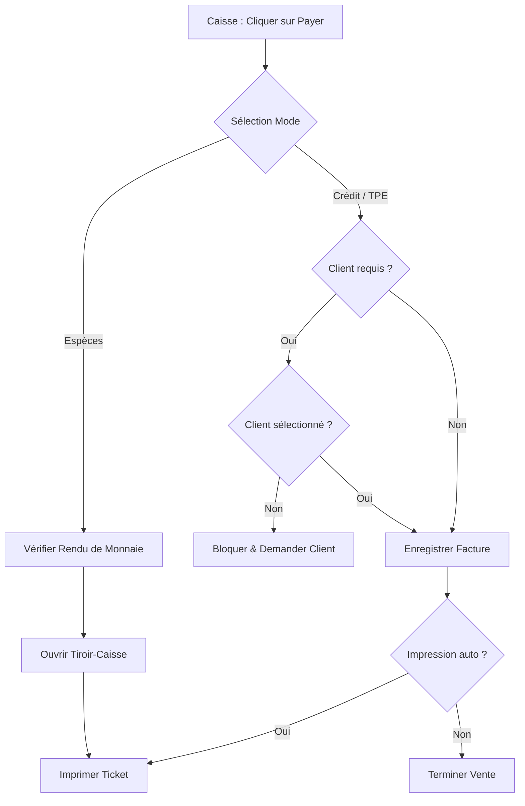
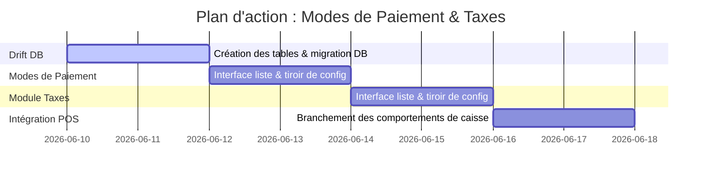

# Plan de Refonte : Modes de Règlement & Taxes (Style Aronium)

Ce document décrit l'architecture, la structure de base de données Drift, et la conception de l'interface utilisateur pour la gestion dynamique des **Modes de Règlement** (Payment Types) et des **Taux de Taxes** (Tax Rates) inspirée d'Aronium.

---

## 1. Module : Modes de Règlement (Payment Types)

Aronium se distingue en permettant de configurer finement le comportement de chaque mode de paiement (ex : ouvrir le tiroir-caisse uniquement pour les espèces, exiger un client pour le paiement à crédit).

### A. Structure de Données (Drift / SQLite)
Nous définissons une table `payment_methods` pour rendre les modes de règlement entièrement configurables :

```dart
class PaymentMethods extends Table {
  TextColumn get id => text()();
  TextColumn get name => text().withLength(min: 1, max: 50)(); // Ex: Espèces, TPE, Chèque, Offert
  TextColumn get code => text().nullable()();
  TextColumn get shortcutKey => text().nullable()(); // Raccourci clavier de caisse
  IntColumn get position => integer().withDefault(const Constant(1))(); // Ordre d'affichage
  BoolColumn get isEnabled => boolean().withDefault(const Constant(true))();
  BoolColumn get quickPayment => boolean().withDefault(const Constant(true))(); // Accès rapide en caisse
  BoolColumn get customerRequired => boolean().withDefault(const Constant(false))(); // Exige un client lié
  BoolColumn get changeAllowed => boolean().withDefault(const Constant(true))(); // Permet le rendu de monnaie
  BoolColumn get markAsPaid => boolean().withDefault(const Constant(true))(); // Valide directement la vente
  BoolColumn get printReceipt => boolean().withDefault(const Constant(true))(); // Déclenche l'impression
  BoolColumn get openCashDrawer => boolean().withDefault(const Constant(false))(); // Ouvre le tiroir-caisse

  @override
  Set<Column> get primaryKey => {id};
}
```

### B. Comportements en Caisse (POS Checkout Workflow)
Chaque mode de paiement influence directement le flux de validation de commande :



### C. Interface Utilisateur (Layout Split-Pane)
*   **Tableau principal** : Liste détaillée des modes configurés avec des pastilles de statut pour chaque indicateur opérationnel (Rendu de monnaie autorisé, Impression auto, etc.).
*   **Tiroir d'édition latéral droit (EndDrawer)** :
    *   Formulaire compact avec switches de configuration thématiques (Verts pour activés, Noir/Gris pour désactivés).
    *   Sélecteur d'ordre d'affichage (`- Position +`).

---

## 2. Module : Taxes (Tax Rates)

La fiscalité marocaine impose la gestion de différents taux de TVA (20%, 14%, 10%, 7%) avec ou sans prorata, ainsi que des taxes fixes (comme la taxe de débit de boissons).

### A. Structure de Données (Drift / SQLite)

```dart
class TaxRates extends Table {
  TextColumn get id => text()();
  TextColumn get name => text().withLength(min: 1, max: 50)(); // Ex: TVA 20%, Taxe Boisson
  TextColumn get code => text().nullable()();
  RealColumn get rate => real().withDefault(const Constant(0.0))(); // Valeur numérique (ex: 20 ou 10)
  BoolColumn get isFixed => boolean().withDefault(const Constant(false))(); // true = montant fixe en DH
  BoolColumn get isEnabled => boolean().withDefault(const Constant(true))();

  @override
  Set<Column> get primaryKey => {id};
}
```

### B. Interface Utilisateur
*   **Liste des Taxes** : Tableau indiquant le code, le nom, le taux (ex : `20.00 %` ou `1.50 DH`) et si elle est active. Option "Changer de Taxe" pour réaffecter massivement des produits.
*   **Tiroir de saisie latéral droit (EndDrawer)** :
    *   Saisie du nom et du code.
    *   Sélecteur de taux numérique (`- Rate + %`).
    *   Commutateur `Montant fixe` (pour basculer de taux en % à montant fixe en DH).
    *   Commutateur `Activée`.

---

## 3. Plan de Travail Réparti


