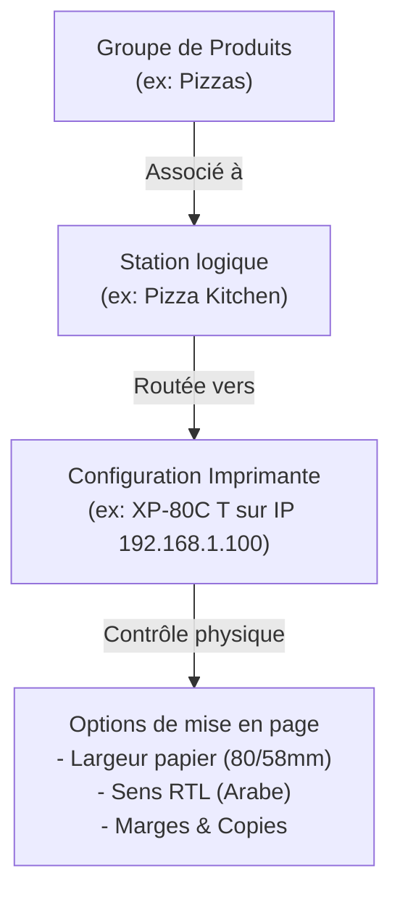
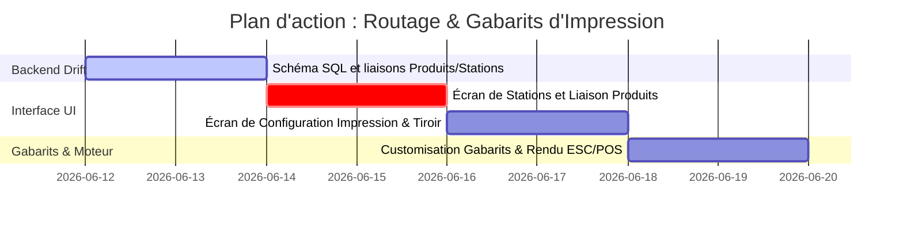

# Plan de Refonte : Gestion des Stations d'Impression & Modèles de Tickets

Ce document définit l'implémentation de la **Gestion de l'Impression** dans Ritagestion POS, basée sur la configuration d'Aronium. Il inclut le routage par stations d'impression, la configuration fine des pilotes physiques et la personnalisation des gabarits de tickets et factures (ICE client, détails de TVA, mentions légales).

---

## 1. Architecture de l'Impression

Le système s'articule autour de trois concepts clés :
1.  **Stations d'Impression (Print Stations)** : Cibles logiques d'envoi en cuisine ou préparation (ex: Cuisine, Bar, Pizza).
2.  **Liaison Groupes de Produits** : Les catégories de produits sont mappées vers une ou plusieurs stations (ex: la catégorie Shawarma est routée vers la station Cuisine).
3.  **Imprimantes Physiques (Printers)** : Les stations logiques sont associées à des imprimantes réelles (IP ESC/POS, Port COM série ou pilote d'impression système Windows).



---

## 2. Structures de Données Drift (SQLite)

### A. Liaisons Groupes de Produits / Stations d'Impression
```dart
class ProductGroupPrintStations extends Table {
  TextColumn get categoryId => text()(); // Groupe de produits / Catégorie
  TextColumn get printStationId => text()(); // Identifiant de la station

  @override
  Set<Column> get primaryKey => {categoryId, printStationId};
}
```

### B. Configuration de l'Imprimante de Station
```dart
class PrinterConfigurations extends Table {
  TextColumn get id => text()();
  TextColumn get name => text()(); // Ex: Imprimante Cuisine 1
  TextColumn get connectionType => text().withDefault(const Constant('network'))(); // 'network' (IP), 'usb', 'serial', 'system'
  TextColumn get targetAddress => text()(); // Ex: '192.168.1.100' ou nom du pilote système
  IntColumn get paperSize => integer().withDefault(const Constant(80))(); // 80 ou 58 mm
  IntColumn get numberOfCopies => integer().withDefault(const Constant(1))();
  RealColumn get marginTop => real().withDefault(const Constant(0.0))();
  RealColumn get marginLeft => real().withDefault(const Constant(0.0))();
  RealColumn get marginBottom => real().withDefault(const Constant(0.0))();
  RealColumn get marginRight => real().withDefault(const Constant(0.0))();
  BoolColumn get isRtl => boolean().withDefault(const Constant(false))(); // Sens de l'arabe
  TextColumn get headerText => text().nullable()();
  TextColumn get footerText => text().nullable()();
  TextColumn get fontName => text().nullable()();
  RealColumn get fontSizePercent => real().withDefault(const Constant(100.0))(); // Zoom police

  @override
  Set<Column> get primaryKey => {id};
}
```

---

## 3. Détail des Interfaces Utilisateur

### A. Écran de Gestion des Stations (`Print stations`)
*   **Tableau récapitulatif** : Liste simple des stations (BAR, CUISINE, PIZZA).
*   **Volet de création/modification** : Permet de nommer la station logique.
*   **Liaison dans l'Éditeur de Produits** : Onglet `Stations d'impression` dans la modification de groupe de produits pour ajouter/retirer des routages.

### B. Configuration de l'Impression dans les Paramètres (`PrintSettings`)
Ce panneau comporte 4 onglets :

#### Onglet 1 : Sélection d'Imprimante (`Printer selection`)
*   Configuration des imprimantes pour les fonctions système (Ticket de vente, Factures A4, Tickets de cuisine globaux).
*   Section **Print stations** : Associe chaque station logique à son imprimante physique (sélection par menu déroulant) avec un bouton d'accès rapide aux configurations de l'imprimante (Roue crantée).

#### Onglet 2 : Personnalisation du Ticket (`Customize receipt`)
*   **Contrôle du format financier** : Choix du nombre de décimales (ex : `- 2 +`).
*   **Toggles d'affichage** :
    *   Imprimer les totaux de taxes et les noms de taxes.
    *   Imprimer le nombre d'articles distincts et la quantité cumulée.
    *   Imprimer l'unité de mesure, le numéro de ticket court ou le numéro de commande.
    *   Imprimer le solde restant dû (Outstanding balance).
*   **Informations Client sur Ticket** : Cases à cocher pour inclure le Nom, Code, Identifiant Fiscal (Tax number), Adresse, Téléphone et Email.
*   **Formatage Dynamique d'Adresse** :
    *   Éditeur de masque d'adresse avec jokers (ex : `%STREET_NAME% %BUILDING_NUMBER%` / `%POSTAL_CODE% %CITY%`).
    *   Volet de prévisualisation en direct de l'adresse formatée.

#### Onglet 3 : Localisation du Ticket (`Localize receipt text`)
*   Interface de traduction ou surcharge des étiquettes imprimées pour s'adapter à la langue cible (ex: français, arabe) :
    *   Champs modifiables : *Numéro d'ICE, Numéro de ticket, Avoir, Commande, Caissier, Nombre d'articles, Remise, Sous-total, Taux de TVA, Total, Montant payé, Rendu monnaie, Solde dû*.
    *   Traduction des libellés clients : *Client, Adresse, Numéro d'ICE, Code, Téléphone, Email*.

#### Onglet 4 : Tiroir de Configuration de l'Imprimante (`Printer settings drawer`)
*   S'ouvre depuis la roue crantée pour configurer l'imprimante sélectionnée.
*   **Options de format** : Type d'imprimante, Taille du papier (80mm / 58mm), Nombre de copies, Bouton d'impression de page test.
*   **Sous-onglet Général** : Marges physiques en millimètres, En-tête/Pied de page personnalisés.
*   **Imprimer le Code-barres** : Génération d'un code-barres (Code128/EAN) en bas de ticket pour relecture et retour automatique rapide au scanner.
*   **Sens d'écriture (Right to left)** : Inversion automatique du texte pour l'arabe.
*   **Configuration de la police** : Police système/ESC et échelle de taille (50% à 150%).

#### Onglet 5 : Gabarits d'Impression (`Print templates`)
*   Personnalisation visuelle de la Facture A4 (Invoice) :
    *   Titre de la facture (ex: *Facture* ou *Facture Simplifiée*).
    *   Commutateur A5 (impression demi-page).
    *   Sélection des colonnes actives (TVA, Remise unitaire).
    *   Sélection des informations clients imprimées (Imprimer le **Numéro d'ICE**, le Code client, Téléphone, Email).
    *   Configuration du message de pied de page (Footer).

---

## 5. Plan de Travail Réparti


