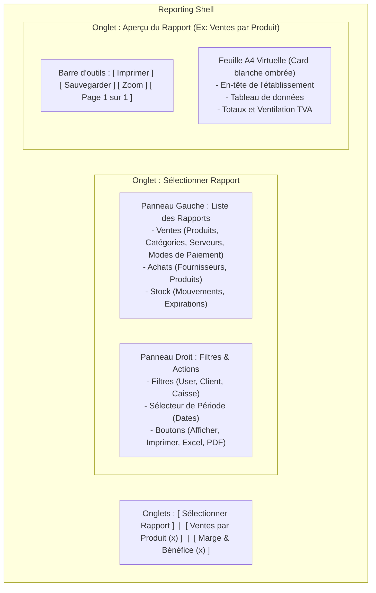
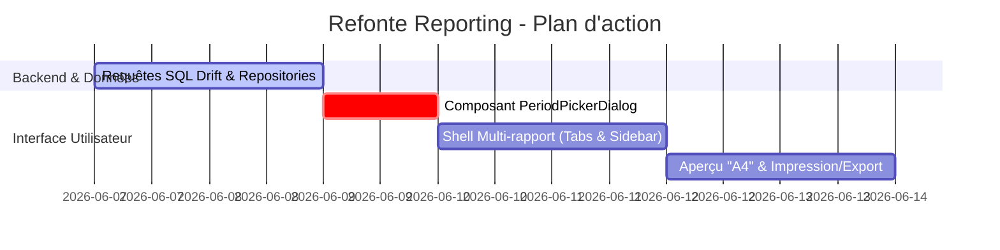

# Plan de Refonte du Module de Rapports (Reporting) au Style Aronium POS

Ce document définit les spécifications fonctionnelles, l'architecture technique et les étapes d'implémentation pour la refonte du module **Statistiques / Rapports** de Ritagestion POS, inspirée du modèle haut de gamme d'Aronium.

---

## 1. Vision Fonctionnelle & Layout

Le module de rapports s'organisera autour d'une interface à **double colonne** avec un **système de navigation par onglets (Tabs)** en haut de page, permettant de garder plusieurs rapports ouverts simultanément.

### Diagramme de Layout UI



---

## 2. Composants Clés à Implémenter

### A. Le Sélecteur de Période Interactif (`period_picker_dialog.dart`)
Pour remplacer le DateRangePicker standard du navigateur ou de Flutter (souvent peu pratique), nous implémenterons un dialogue modal sur mesure comprenant :
*   **Deux calendriers côte à côte** : Un pour la date de début, un pour la date de fin.
*   **Raccourcis rapides de périodes (Quick Filters)** :
    *   *Aujourd'hui / Hier*
    *   *Cette semaine / La semaine dernière*
    *   *Ce mois-ci / Le mois dernier*
    *   *Cette année / L'année dernière*
*   **Actions de validation** : Bouton d'application avec icône de coche.

### B. Le Panneau de Filtres Dynamique
Sur le côté droit de l'écran de sélection :
1.  **Filtre Client / Fournisseur** (Dropdown lié à la table des contacts).
2.  **Filtre Utilisateur / Serveur** (Dropdown lié à la table des utilisateurs/rôles).
3.  **Filtre Caisse / Session** (Dropdown pour cibler une session spécifique).
4.  **Bouton Sélecteur de date** affichant la période en cours.
5.  **Boutons d'action unifiés** :
    *   `Afficher` (Génère le rapport et l'ouvre dans un nouvel onglet).
    *   `Imprimer` (Imprime directement sans aperçu).
    *   `Excel` (Exporte les lignes au format CSV/Excel).
    *   `PDF` (Exporte le document au format PDF natif).

### C. Le Visualiseur de Rapport "A4" (`report_print_preview.dart`)
Pour offrir un aspect premium :
*   Le rapport sera rendu dans un conteneur centré (`SingleChildScrollView`) simulant une **feuille de papier A4** avec une bordure fine et une ombre portée douce (`boxShadow`).
*   Intégration d'une mini barre d'outils pour naviguer entre les pages du rapport ou modifier le niveau de zoom.

---

## 3. Modèles de Données & Requêtes SQL (Drift)

Pour alimenter ces rapports, nous ajouterons de nouvelles requêtes agrégées dans `OrderRepository` :

```dart
// Exemple de structures de données pour les rapports
class ProductSalesReportLine {
  final String productCode;
  final String productName;
  final double quantitySold;
  final String unitOfMeasure;
  final double totalBeforeTax;
  final double totalTax;
  final double totalInclTax;

  ProductSalesReportLine({
    required this.productCode,
    required this.productName,
    required this.quantitySold,
    required this.unitOfMeasure,
    required this.totalBeforeTax,
    required this.totalTax,
    required this.totalInclTax,
  });
}
```

### Requête Drift pour "Ventes par Produit"
```sql
-- Requête SQL sous-jacente pour filtrer et agréger les ventes
SELECT 
    p.code,
    p.name,
    SUM(oi.quantity) as quantity_sold,
    SUM(oi.price_dine_in * oi.quantity / (1 + p.tax_rate/100)) as total_before_tax,
    SUM(oi.price_dine_in * oi.quantity * (p.tax_rate/100) / (1 + p.tax_rate/100)) as total_tax,
    SUM(oi.price_dine_in * oi.quantity) as total_incl_tax
FROM order_items oi
JOIN products p ON oi.product_id = p.id
JOIN orders o ON oi.order_id = o.id
WHERE o.created_at BETWEEN :start_date AND :end_date
  AND (:user_id IS NULL OR o.user_id = :user_id)
GROUP BY p.id;
```

---

## 4. Feuille de Route d'Implémentation



### Étape 1 : Création des requêtes de Reporting dans `core`
*   Modifier `ProductRepository` et `OrderRepository` pour ajouter les méthodes d'agrégation filtrées par date, utilisateur et client.

### Étape 2 : Création du Sélecteur de Période Double Calendrier
*   Créer le widget `PeriodPickerDialog` dans `widgets/reporting/period_picker_dialog.dart`.

### Étape 3 : Création de la Page de Reporting et Gestion des Onglets
*   Remplacer l'écran de statistiques existant (`lib/pages/backoffice/analytics/`) par un contrôleur d'onglets dynamique.
*   Implémenter la liste de sélection des rapports à gauche et les dropdowns de filtres à droite.

### Étape 4 : Exports PDF et Excel
*   Utiliser la bibliothèque Dart `pdf` pour générer des fichiers PDF vectoriels reprenant exactement le layout du rapport A4.
*   Utiliser `csv` ou `excel` pour l'extraction de données tabulaires.
