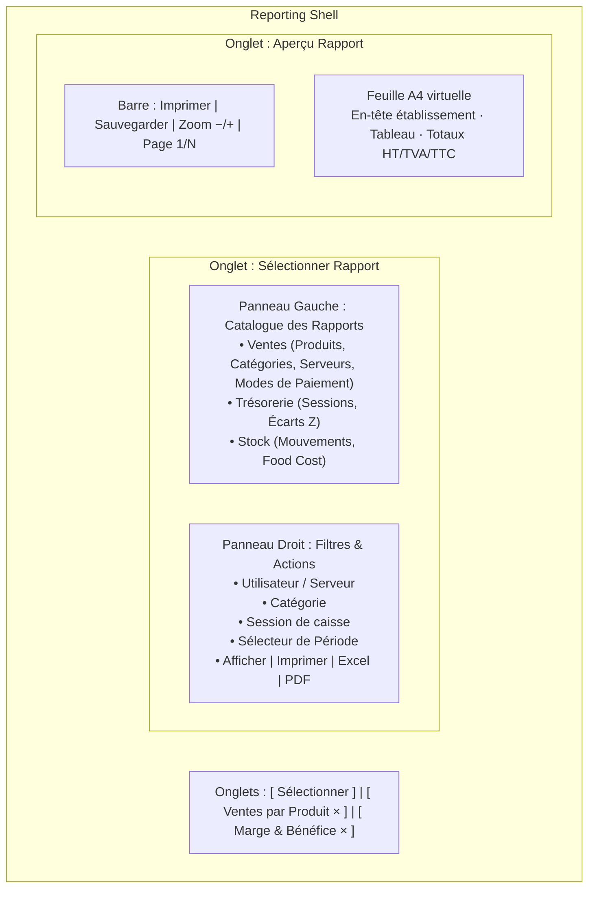
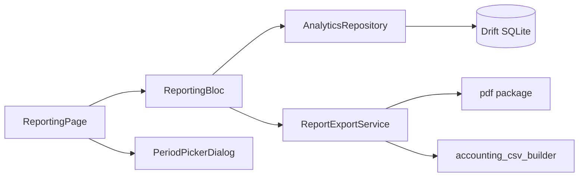
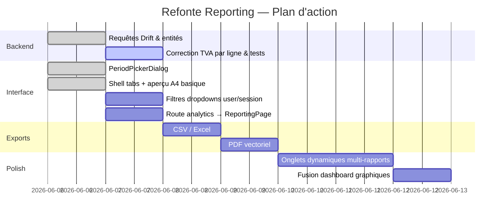

# Plan de Refonte : Statistiques & Reporting (Style Aronium)

Ce document décrit l'architecture, les requêtes Drift, la couche BLoC et la conception UI pour la refonte complète du module **Statistiques / Rapports** de Ritagestion POS, inspirée d'Aronium POS (multi-onglets, filtres avancés, sélecteur de période double calendrier, aperçu A4 tabulaire).

> **Référence produit :** [mega_refonte_commerciale.md](./mega_refonte_commerciale.md) — section tableau de bord, ligne « Refonte Statistiques & Reporting ».

---

## 1. Tableau d'Avancement

| Composant | État | Fichiers / Notes |
| :--- | :---: | :--- |
| Plan d'implémentation | 🟢 Fait | Ce document |
| Entités de rapport (`ReportFilters`, lignes typées) | 🟢 Fait | `packages/core/lib/entities/report_entities.dart` |
| Requêtes Drift agrégées (4 rapports ventes) | 🟢 Fait | `analytics_repository_impl.dart` |
| `PeriodPickerDialog` (double calendrier + raccourcis) | 🟢 Fait | `widgets/reporting/period_picker_dialog.dart` |
| Shell multi-onglets (Sélecteur / Rapport) | 🟢 Fait | `reporting_page.dart` + `ReportingBloc` |
| Aperçu tabulaire style A4 | 🟡 Partiel | Card blanche ombrée ; zoom / pagination à faire |
| Filtres Utilisateur / Session / Catégorie | 🟢 Fait | Dropdowns dans panneau sélecteur |
| Onglets dynamiques multi-rapports | 🟢 Fait | TabBar scrollable avec fermeture × |
| Export PDF natif | 🟢 Fait | `ReportExportService` + package `pdf` |
| Export Excel / CSV | 🟢 Fait | `ReportCsvBuilder` → Bureau |
| Intégration route `/backoffice/analytics` | 🟢 Fait | `ReportingPage` |
| Dashboard KPI (graphiques journaliers) | 🟢 Fait | `ReportType.dashboard` + `ReportDashboardPanel` |
| Tests unitaires rapports | 🔴 À faire | Étendre `analytics_repository_test.dart` |
| En-tête fiscal établissement sur PDF | 🔴 À faire | ICE/IF depuis `RestaurantConfig` |

---

## 2. Vision Fonctionnelle & Layout

Le module s'organise autour d'une interface à **double colonne** avec **navigation par onglets** en tête de page. L'utilisateur peut conserver plusieurs rapports ouverts simultanément (objectif Aronium).

### Diagramme de Layout UI



### Catalogue des Rapports (Phase 1 — Ventes)

| Clé `ReportType` | Libellé UI | Source Drift | Colonnes principales |
| :--- | :--- | :--- | :--- |
| `productSales` | Ventes par Produit | `order_items` + `products` + `categories` | Code, Produit, Catégorie, Qté, HT, TVA, TTC |
| `categorySales` | Ventes par Catégorie | idem, agrégé par catégorie | Catégorie, Qté, HT, TVA, TTC |
| `paymentMethods` | Modes de Règlement | `payments` | Mode, Transactions, Total |
| `userSales` | Ventes par Serveur | `orders` + `payments` + `users` | Serveur, Tickets, Total TTC, Panier moy. |
| `dashboard` | Tableau de Bord | `payments` + recettes | KPIs + graphiques (`fl_chart`) |

### Rapports Phase 2 (backlog)

- Ventes par heure / jour de la semaine
- Marge & bénéfice (Food Cost théorique vs CA)
- Rapport Z de session (lien trésorerie)
- Ventilation TVA multi-taux (conformité DGI)
- Export comptable mensuel (déjà partiel via `AccountingExportPage`)

---

## 3. Architecture Technique



### Couche Présentation

| Fichier | Rôle |
| :--- | :--- |
| `pages/backoffice/analytics/reporting_page.dart` | Shell principal (tabs, sélecteur, aperçu A4) |
| `widgets/reporting/period_picker_dialog.dart` | Dialogue double calendrier + raccourcis |
| `widgets/reporting/report_print_preview.dart` | *(à créer)* Feuille A4 réutilisable + toolbar zoom |
| `blocs/reporting/reporting_bloc.dart` | Orchestration filtres / exécution / export |

### Couche Domaine / Données

| Fichier | Rôle |
| :--- | :--- |
| `entities/report_entities.dart` | `ReportFilters`, `ReportHeader`, lignes typées |
| `repositories/analytics_repository.dart` | Contrat des 4 rapports + dashboard |
| `repositories/analytics_repository_impl.dart` | Agrégations Drift sur commandes `PAID` |

### Règles métier communes

1. **Période** : filtrage sur `payments.paidAt` entre `startDate 00:00` et `endDate 23:59:59` (fin exclusive +1 jour).
2. **Commandes valides** : statut `PAID` uniquement ; lignes `order_items` excluant `VOIDED`.
3. **Prix figés** : toujours `order_items.unitPrice` (jamais le prix catalogue actuel).
4. **TVA** : calcul HT/TVA par ligne via `order_items.taxRate` (taux au moment de la vente).
5. **Filtre utilisateur** : `orders.waiterId == userId` quand renseigné.
6. **Filtre catégorie** : restriction produits avant agrégation.
7. **Filtre session** : `orders.sessionId == sessionId` *(Phase 1b — ajouter au modèle `ReportFilters`)*.

---

## 4. Composants UI Détaillés

### A. Sélecteur de Période (`PeriodPickerDialog`)

Implémenté avec :
- Deux `CalendarDatePicker` côte à côte (début / fin).
- Colonne de raccourcis : Aujourd'hui, Hier, Cette semaine, Semaine dernière, Ce mois-ci, Mois dernier, Cette année, Année dernière.
- Bandeau récapitulatif et boutons Annuler / Appliquer.

### B. Panneau de Filtres Dynamique

À compléter sur le panneau droit de l'onglet « Sélectionner » :

1. **Utilisateur / Serveur** — `DropdownButtonFormField` alimenté par `SELECT * FROM users WHERE is_active`.
2. **Catégorie** — dropdown optionnel pour rapports produits.
3. **Session de caisse** — dropdown des sessions clôturées sur la période.
4. **Bouton période** — ouvre `PeriodPickerDialog`.
5. **Actions** :
   - `Afficher` → `ReportingRunRequested` + bascule onglet Rapport.
   - `Imprimer` → aperçu système ou ESC/POS A4.
   - `Excel` → CSV UTF-8 BOM (`;`).
   - `PDF` → génération vectorielle identique à l'aperçu.

### C. Visualiseur A4 (`report_print_preview.dart`)

Spécifications :
- Conteneur centré, ratio A4 (210×297 mm), fond blanc, `boxShadow` douce.
- En-tête : nom établissement, ICE/IF (depuis `RestaurantConfig`), titre rapport, période, date de génération.
- Corps : `Table` zebra-striping Material 3.
- Pied : totaux HT / TVA / TTC + nombre de tickets.
- Toolbar : zoom 75 % – 125 %, navigation pages si > 40 lignes.

---

## 5. Modèles de Données & Requêtes SQL

### Entités (`report_entities.dart`)

```dart
class ReportFilters {
  final DateTime startDate;
  final DateTime endDate;
  final String? userId;
  final String? categoryId;
  final String? paymentMethodId;
  final String? sessionId; // Phase 1b
}
```

### Exemple — Ventes par Produit

Logique Drift (pas de SQL brut) :

```dart
// 1. Résoudre orderIds PAID sur la période (+ filtres user/session)
// 2. Charger order_items non VOIDED
// 3. Joindre products + categories
// 4. Agréger qty et TTC par productId
// 5. Calculer HT/TVA via item.taxRate
```

Requête SQL équivalente :

```sql
SELECT
    p.barcode AS code,
    p.name,
    c.name AS category,
    SUM(oi.quantity) AS qty,
    SUM(oi.quantity * oi.unit_price) AS total_ttc
FROM order_items oi
JOIN products p ON oi.product_id = p.id
JOIN categories c ON p.category_id = c.id
JOIN orders o ON oi.order_id = o.id
JOIN payments pay ON pay.order_id = o.id
WHERE o.status = 'PAID'
  AND oi.status != 'VOIDED'
  AND pay.paid_at >= :start AND pay.paid_at < :end_exclusive
  AND (:user_id IS NULL OR o.waiter_id = :user_id)
GROUP BY p.id
ORDER BY total_ttc DESC;
```

---

## 6. BLoC — Événements & États

```dart
// Events
ReportingStarted()
ReportingFiltersChanged(ReportFilters)
ReportingTypeSelected(ReportType)
ReportingRunRequested()
ReportingExportRequested(ReportExportFormat) // Phase 2

// States
ReportingInitial()
ReportingLoading()
ReportingReady(filters, selectedType, header, rows)
ReportingError(message)
```

---

## 7. Plan de Travail Réparti



### Étape 1 — Backend & corrections *(en cours)*

- [x] Créer `report_entities.dart` et méthodes dans `AnalyticsRepository`.
- [x] Implémenter agrégations produit / catégorie / paiement / serveur.
- [ ] Corriger `paymentMethod` (pas `method`), code produit via `barcode`.
- [ ] TVA catégories : moyenne pondérée par `order_items.taxRate`.
- [ ] Exporter `report_entities.dart` depuis `core.dart`.
- [ ] Tests unitaires par type de rapport.

### Étape 2 — Interface sélecteur

- [x] `PeriodPickerDialog` double calendrier.
- [x] Liste types de rapports (panneau gauche).
- [ ] Dropdowns filtres utilisateur / catégorie / session.
- [ ] Brancher `ReportingPage` sur `/backoffice/analytics`.

### Étape 3 — Aperçu & exports

- [x] Aperçu tabulaire basique (Card A4).
- [ ] Extraire `ReportPrintPreview` widget réutilisable.
- [ ] Toolbar zoom / pagination.
- [ ] Export CSV et PDF fonctionnels.

### Étape 4 — Polish Aronium

- [ ] Onglets dynamiques (un par rapport généré, fermeture ×).
- [ ] Intégrer dashboard KPI (graphiques existants) comme type `dashboard`.
- [ ] En-tête fiscal établissement sur chaque rapport imprimable.

---

## 8. Checklist de Validation

- [ ] Rapport « Ventes par Produit » sur une journée avec 2 taux TVA différents → totaux HT/TVA cohérents.
- [ ] Filtre serveur → seules ses commandes apparaissent.
- [ ] Période « Hier » via raccourci → données correctes vs dashboard.
- [ ] Export CSV ouvrable dans Excel (UTF-8 BOM, séparateur `;`).
- [ ] PDF généré = rendu identique à l'aperçu écran.
- [ ] Aucune régression sur `loadDailyDashboard` (graphiques du jour).

---

## 9. Dépendances Packages

| Package | Usage |
| :--- | :--- |
| `flutter_bloc` | `ReportingBloc` |
| `equatable` | États immuables |
| `intl` | Formatage dates / montants |
| `pdf` + `printing` | Export PDF et impression |
| `csv` | Export tabulaire |
| `fl_chart` | Dashboard (existant) |
