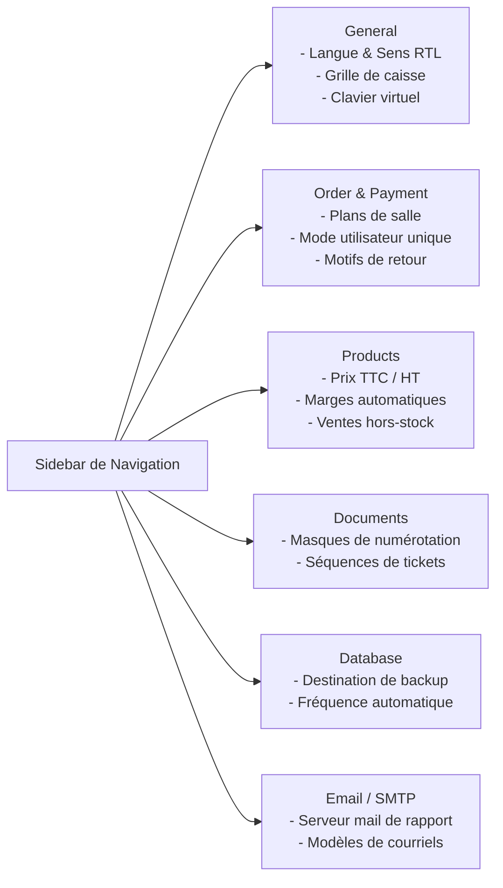
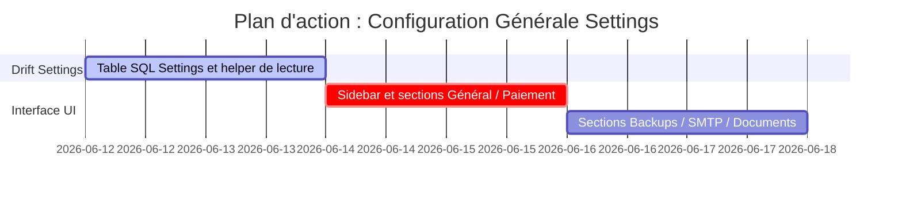

# Plan de Refonte : Paramètres Généraux de l'Application

Ce document définit la structure des préférences, l'architecture SQLite/Prefs, et la conception de l'interface utilisateur pour le panneau des **Paramètres (Settings)** de Ritagestion POS, inspiré de la configuration multi-onglet d'Aronium.

---

## 1. Organisation de l'Interface des Paramètres

L'écran des Paramètres s'organise avec un menu de navigation latéral gauche et un panneau de configuration central dynamique :



---

## 2. Structure Technique des Paramètres (Drift / LocalPrefs)

Pour persister ces options de manière performante et dynamique, nous divisons le stockage :
1.  **Préférences UI locales** (ex: zoom, taille de police, thème) -> persistées via `shared_preferences` ou `Hive`.
2.  **Configuration Business / Métier** (ex: blocage vente hors-stock, TVA incluse, SMTP) -> persistée en base de données Drift pour être synchronisée ou restaurée en cas de réinstallation :

```dart
class AppSettings extends Table {
  TextColumn get key => text()(); // Clé unique (ex: 'app.language', 'sales.prevent_negative')
  TextColumn get value => text()(); // Valeur sérialisée en JSON ou chaîne simple
  TextColumn get group => text()(); // Groupe (ex: 'general', 'payment', 'products')

  @override
  Set<Column> get primaryKey => {key};
}
```

---

## 3. Détail des Sections de Configuration

### A. Onglet 1 : Général (`General`)
*   **Style d'application** :
    *   Choix de langue et sens d'écriture (LTR / RTL pour le marché marocain/arabe).
    *   Sélecteur de thème (Sombre / Clair).
    *   Taille de grille de caisse (`- Rows + / - Cols +`).
    *   Activation du clavier virtuel (écran tactile).
*   **Journée commerciale (Business Day)** :
    *   Saisie obligatoire des fonds de caisse (Cash-in) au démarrage de la journée commerciale.
*   **Barre d'actions de caisse (Button bar)** :
    *   Cases à cocher pour afficher les boutons d'accès rapide dans la caisse (Recherche, Transfert, Client, Remise, Commentaire, etc.).

### B. Onglet 2 : Commande & Paiement (`Order & payment`)
*   **Items** :
    *   Recherche par défaut (Nom, Code, Code-barres).
    *   Bloquer la vente en-dessous du prix d'achat.
    *   Bloquer la vente en cas de stock négatif.
*   **Utilisateurs** :
    *   Mode utilisateur unique (Single User) : pas de verrouillage de session automatique après chaque ticket.
*   **Paiement** :
    *   Fusionner les articles identiques sur le ticket (regroupement de lignes).
    *   Activer les remises sur article unitaire.
*   **Service type (Modes de consommation)** :
    *   Activer la sélection du mode (Sur place / Emporter / Livraison).

### C. Onglet 3 : Produits (`Products`)
*   Configuration de l'inclusion des taxes (Affichage et impression prix TTC ou HT).
*   Application de la remise (Avant ou après calcul des taxes).
*   Calcul du prix de revient moyen pondéré (PUMP) automatique à la réception des achats.

### D. Onglet 4 : Documents (`Documents`)
*   Configuration du masque de numérotation séquentielle des tickets de caisse :
    *   Exemple de masque : `%YEAR%-%TYPE%-%COUNTER%`
    *   Génère un format : `26-200-000001` (26 = année 2026, 200 = code caisse, 000001 = compteur séquentiel).

### E. Onglet 5 : Base de données & Backups (`Database`)
*   **Sauvegarde automatique** :
    *   Activation de l'auto-backup.
    *   Déclencheurs : Au démarrage de l'application / À la fermeture.
    *   Emplacement physique des archives.
    *   Rotation : Suppression automatique des archives datant de plus de X jours.

### F. Onglet 6 : Configuration E-mail (`Email`)
*   Paramètres d'envoi SMTP (Serveur, Port, Chiffrement SSL/TLS, Identifiant, Mot de passe).
*   Permet d'envoyer directement les rapports de fin de journée Z-Report par email aux gérants et les factures PDF aux clients.

---

## 4. Plan de Travail Réparti


