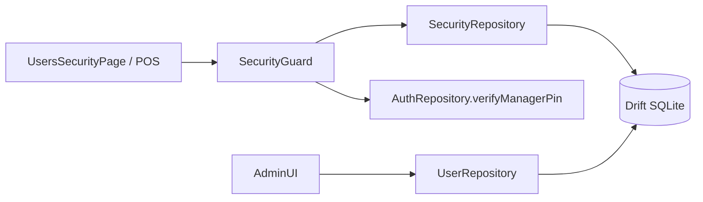
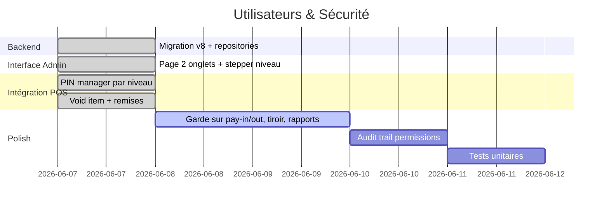

# Plan de Refonte : Utilisateurs & Sécurité RBAC (Style Aronium)

Ce document décrit l'architecture, la structure Drift, la couche repositories, le moteur `SecurityGuard` et la conception UI pour la refonte du module **Utilisateurs & Sécurité** de Ritagestion POS — système hiérarchique de niveaux d'accès numériques **0 à 9** inspiré d'Aronium.

> **Référence produit :** [mega_refonte_commerciale.md](./mega_refonte_commerciale.md) — ligne « Utilisateurs & Sécurité (RBAC) ».

---

## 1. Tableau d'Avancement

| Composant | État | Fichiers / Notes |
| :--- | :---: | :--- |
| Plan d'implémentation | 🟢 Fait | Ce document |
| Colonne `accessLevel` sur `users` (migration v8) | 🟢 Fait | `tables/users.dart` |
| Table `security_rules` + seed 20 opérations | 🟢 Fait | `tables/security_rules.dart`, `DefaultSecurityRules` |
| `SecurityRepository` + `UserRepository` | 🟢 Fait | `security_repository_impl.dart` |
| `SecurityGuard` + PIN manager par niveau | 🟢 Fait | `security_guard.dart`, `manager_pin_dialog.dart` |
| Page admin 2 onglets (Utilisateurs / Sécurité) | 🟢 Fait | `users_security_page.dart` |
| Route `/backoffice/security` | 🟢 Fait | `app_router.dart`, lien depuis Paramètres |
| Menu principal filtré par `accessLevel >= 7` | 🟢 Fait | `main_menu_page.dart` |
| Intégration remises & void cuisine | 🟢 Fait | `discount_flow.dart`, `manager_auth.dart` |
| Pay-in/out, tiroir, clôture Z, backoffice | 🟢 Fait | `SecurityGuard`, `SecurityGate` |
| Audit trail permissions & utilisateurs | 🟢 Fait | `SECURITY_RULE_CHANGE`, `USER_ACCESS_CHANGE` |
| Tests unitaires repositories | 🟢 Fait | `security_repository_test.dart` |
| Extension prénom/nom/email utilisateur | 🔴 À faire | Migration v9 |
| Garde réimpression ticket POS | 🔴 À faire | `reprintReceipt` |

---

## 2. Concept : Niveaux d'Accès 0-9

Plutôt qu'une matrice de cases à cocher, Aronium utilise une hiérarchie linéaire :

| Niveau | Profil type | Exemples |
| :---: | :--- | :--- |
| **0** | Serveur stagiaire | Prise de commande uniquement |
| **3** | Caissier | Encaissement, clôture Z, tiroir |
| **7** | Manager | Backoffice, rapports, stocks |
| **9** | Propriétaire / Admin | Paramètres, sécurité, promotions |

**Règle :** accès accordé si `user.accessLevel >= rule.requiredLevel`.

**Surpassement :** si niveau insuffisant → dialogue PIN demandant un utilisateur avec `accessLevel >= requiredLevel`.

### Mapping rôle → niveau (migration & seed)

| Rôle Drift | Niveau par défaut |
| :--- | :---: |
| `ADMIN` | 9 |
| `MANAGER` | 7 |
| `CASHIER` | 3 |
| `WAITER` | 0 |

---

## 3. Structure de Données (Drift v8)

### Table `users` (étendue)

```dart
class Users extends Table {
  TextColumn get id => text().clientDefault(newUuid)();
  TextColumn get name => text()();
  TextColumn get pinHash => text()();
  TextColumn get role => text()();
  IntColumn get accessLevel => integer().withDefault(const Constant(0))();
  BoolColumn get isActive => boolean().withDefault(const Constant(true))();
  // createdAt, updatedAt
}
```

> **Note :** le plan initial prévoyait `firstName` / `lastName` / `email`. Phase 2 — le champ `name` unique est conservé pour compatibilité.

### Table `security_rules`

```dart
class SecurityRules extends Table {
  TextColumn get operationKey => text()();  // ex: void_item
  TextColumn get category => text()();      // general | sales | backoffice | stock
  TextColumn get label => text()();
  IntColumn get requiredLevel => integer().withDefault(const Constant(0))();
  TextColumn get description => text().nullable()();
}
```

### Catalogue des opérations (`SecurityOperations`)

| Clé | Catégorie | Libellé | Niveau défaut |
| :--- | :--- | :--- | :---: |
| `backoffice_access` | general | Accès backoffice | 7 |
| `settings_access` | general | Paramètres | 9 |
| `close_session` | general | Clôture Z | 3 |
| `void_item` | sales | Annuler article (cuisine) | 9 |
| `apply_discount` | sales | Remise | 9 |
| `analytics_access` | backoffice | Statistiques | 7 |
| `security_manage` | backoffice | Gestion sécurité | 9 |
| … | … | 20 opérations au total | … |

Voir `packages/core/lib/constants/security_operations.dart`.

---

## 4. Architecture



### Fichiers clés

| Couche | Fichier |
| :--- | :--- |
| Tables | `tables/users.dart`, `tables/security_rules.dart` |
| Constantes | `constants/security_operations.dart` |
| Repositories | `security_repository.dart`, `security_repository_impl.dart` |
| App guard | `utils/security_guard.dart` |
| Admin UI | `pages/backoffice/security/users_security_page.dart` |
| PIN manager | `widgets/dialogs/manager_pin_dialog.dart` |
| Widget | `widgets/backoffice/access_level_stepper.dart` |

---

## 5. Interface Utilisateur

### Onglet Utilisateurs

- Tableau : Nom, Rôle, Niveau, Statut actif
- Barre d'outils : Ajouter, Modifier, Désactiver, Actualiser, filtre inactifs
- Tiroir latéral 360px : nom, rôle, stepper niveau 0-9, PIN, toggle actif

### Onglet Sécurité

- Cartes par catégorie (Général, Ventes, Backoffice, Stock)
- Chaque ligne : libellé + tooltip + stepper `- N +`
- Boutons Enregistrer / Actualiser

### Accès navigation

- Paramètres → carte « Utilisateurs & Sécurité » → `/backoffice/security`
- Menu principal backoffice : `accessLevel >= 7`

---

## 6. SecurityGuard — API

```dart
// Vérification avec surpassement PIN automatique
final ok = await SecurityGuard.checkAccess(
  context,
  SecurityOperations.voidItem,
);

// Vérification synchrone (sans PIN)
SecurityGuard.hasAccess(user, requiredLevel);
```

`AuthRepository.verifyManagerPin(pin, minLevel: N)` remplace l'ancien filtre `role == ADMIN`.

---

## 7. Plan de Travail Réparti



### Étape 1 — Backend *(fait)*

- [x] Migration Drift v8 (`accessLevel`, `security_rules`)
- [x] Backfill niveaux depuis `role`
- [x] Seed 20 règles par défaut
- [x] `UserRepository` CRUD + reset PIN

### Étape 2 — Interface admin *(fait)*

- [x] Page `UsersSecurityPage` (2 onglets)
- [x] `AccessLevelStepper` réutilisable
- [x] Route + sidebar + lien Paramètres

### Étape 3 — Intégration POS *(fait)*

- [x] `ManagerPinDialog` avec `requiredLevel`
- [x] Remises (`apply_discount`)
- [x] Void article envoyé cuisine
- [x] Pay-in / Pay-out trésorerie
- [x] Ouverture tiroir manuelle (encaissement + audit)
- [x] Clôture Z (`close_session`)
- [x] Accès modules backoffice via `SecurityGate`
- [ ] Réimpression ticket

### Étape 4 — Qualité *(fait)*

- [x] Tests `SecurityRepository` / `UserRepository`
- [x] Audit `security_manage` sur changement de règles et utilisateurs
- [ ] Migration prénom/nom (optionnel)

---

## 8. Checklist de Validation

- [ ] Serveur niveau 0 → void cuisine bloqué → PIN admin 1234 autorise
- [ ] Caissier niveau 3 → clôture Z OK, backoffice refusé
- [ ] Admin niveau 9 → accès total sans PIN
- [ ] Modification niveau requis « Remise » à 3 → caissier peut remiser sans PIN
- [ ] Désactivation utilisateur → PIN refusé au login
- [ ] Migration v7→v8 : rôles existants mappés correctement

---

## 9. Dépendances

| Package | Usage |
| :--- | :--- |
| `drift` | Tables & migration |
| `bcrypt` (via `PinHasher`) | Hash PIN |
| `data_table_2` | Liste utilisateurs |
| `flutter_bloc` | *(optionnel phase 2)* |
