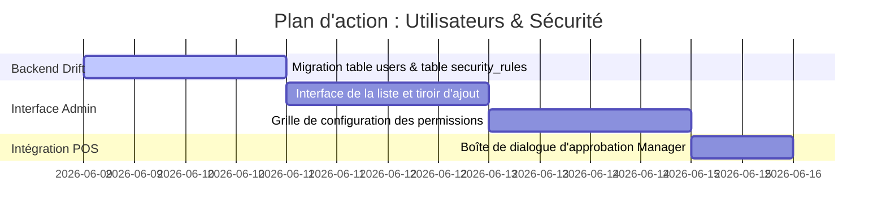

# Plan de Refonte : Utilisateurs & Sécurité RBAC (Style Aronium)

Ce document décrit l'architecture, la structure de base de données Drift, et la conception de l'interface utilisateur pour la refonte complète du module **Utilisateurs & Sécurité** de Ritagestion POS. Il s'inspire du système de niveaux d'accès numériques (0 à 9) d'Aronium, particulièrement efficace et simple pour l'environnement de caisse.

---

## 1. Concept de Sécurité : Niveaux d'Accès Numériques (0-9)

Plutôt que d'avoir une matrice complexe de dizaines de cases à cocher par utilisateur, le système d'Aronium utilise une logique hiérarchique linéaire :
*   Chaque **Utilisateur** possède un niveau d'accès compris entre **0** (accès minimal, ex: serveur stagiaire) et **9** (accès total, ex: propriétaire/administrateur).
*   Chaque **Opération** critique (ex: annuler un article, ouvrir le tiroir-caisse, accéder aux rapports) requiert un niveau d'accès minimum (configurable de 0 à 9).
*   **Règle d'autorisation** : L'accès est accordé si `NiveauUtilisateur >= NiveauRequisOperation`.
*   **Avantage UX** : Si un serveur (niveau 0) tente une action nécessitant un niveau 9 (ex: *Annuler un article*), la caisse affiche instantanément un pavé numérique demandant le **code PIN d'un manager** pour autoriser ponctuellement l'action.

---

## 2. Structure de Données (Drift / SQLite)

### A. Table des Utilisateurs
Nous adaptons la table `users` existante pour inclure le niveau d'accès numérique :

```dart
class Users extends Table {
  TextColumn get id => text()();
  TextColumn get firstName => text().withLength(min: 1, max: 50)();
  TextColumn get lastName => text().nullable()();
  TextColumn get email => text().nullable()();
  TextColumn get passwordHash => text()(); // Mot de passe / Code PIN chiffré
  IntColumn get accessLevel => integer().withDefault(const Constant(0))(); // Niveau 0 à 9
  BoolColumn get isActive => boolean().withDefault(const Constant(true))();
  DateTimeColumn get createdAt => dateTime()();
  
  @override
  Set<Column> get primaryKey => {id};
}
```

### B. Table des Permissions d'Opérations (Security Rules)
Pour stocker la configuration personnalisable du niveau d'accès requis pour chaque opération :

```dart
class SecurityRules extends Table {
  TextColumn get operationKey => text()(); // Clé unique de l'opération (ex: 'void_item', 'open_drawer')
  TextColumn get category => text()();     // Catégorie pour l'UI (ex: 'sales', 'management', 'stock')
  TextColumn get label => text()();        // Libellé en français (ex: 'Annuler un article')
  IntColumn get requiredLevel => integer().withDefault(const Constant(0))(); // Niveau requis (0-9)

  @override
  Set<Column> get primaryKey => {operationKey};
}
```

---

## 3. Interface Utilisateur (Layout à Deux Onglets)

Le module d'administration comportera deux onglets principaux :

### Onglet 1 : Utilisateurs (`Users`)
*   **Tableau principal** : Colonnes *Prénom*, *Nom*, *Email*, *Niveau d'accès* (0-9), *Statut Actif*.
*   **Barre d'outils supérieure** : Boutons `Ajouter un utilisateur`, `Modifier`, `Supprimer`, `Réinitialiser le mot de passe`, et filtre `Afficher les inactifs`.
*   **Volet de saisie latéral droit (EndDrawer)** :
    *   Formulaire d'ajout/édition d'utilisateur.
    *   Sélecteur numérique interactif pour le niveau d'accès (`- 0 +` avec incrémenteur/décrémenteur limité de 0 à 9).
    *   Toggle d'activation du compte.

### Onglet 2 : Sécurité (`Security`)
*   **Panneau de configuration global** :
    *   Regroupement par accordéons ou cartes thématiques :
        *   **Général** : Accès au Backoffice, Paramètres, Clôture de caisse (Z-Report), Modification de plan de salle.
        *   **Ventes (Caisse)** : Annulation d'article, Annulation de commande, Remises, Saisie de fonds de caisse, Réimpression de ticket, Ouverture manuelle du tiroir-caisse, Vente hors-stock.
        *   **Gestion Backoffice** : Dashboard, Produits, Stocks, Clients, Promotions, Gestion de la sécurité.
        *   **Stock** : Inventaire rapide, Affichage des prix d'achat.
    *   Chaque ligne d'opération présente le libellé de l'action avec une bulle d'aide (Tooltip) explicative, et un sélecteur numérique `- X +` pour définir le niveau d'accès requis.
    *   Boutons d'action unifiés dans l'en-tête de l'onglet : `Actualiser` et `Enregistrer`.

---

## 4. Gardien d'Accès (Security Guard Engine)

Un helper global facilitera la vérification des droits dans le code de l'application :

```dart
class SecurityGuard {
  static Future<bool> checkAccess(String operationKey, BuildContext context) async {
    final currentUser = sl<AuthService>().currentUser;
    if (currentUser == null) return false;

    final requiredLevel = await sl<SecurityRepository>().getRequiredLevel(operationKey);
    if (currentUser.accessLevel >= requiredLevel) {
      return true;
    }

    // Si le niveau est insuffisant, ouvrir le clavier PIN pour demander une autorisation manager
    final authorized = await showDialog<bool>(
      context: context,
      builder: (ctx) => ManagerApprovalDialog(requiredLevel: requiredLevel),
    );
    
    return authorized ?? false;
  }
}
```

---

## 5. Feuille de Route d'Implémentation


